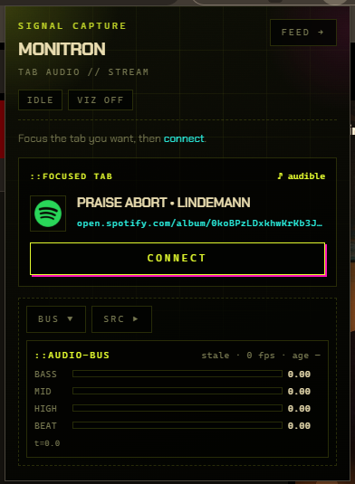
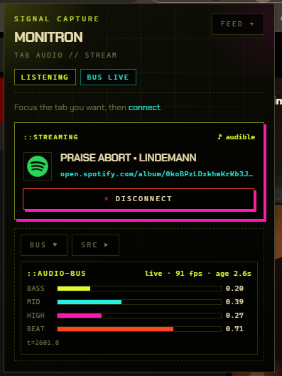

<p align="center">
  
</p>

# Monitron Chrome Extension

Chrome extension that captures audio from a browser tab and feeds live EQ bands into **Monitron** dynamic screensavers on [Monitron](https://monitron-web-gamma.vercel.app/).

Captures tab audio as a **raw log-spaced spectrum** (`bands[32]` + `rms` / `peak`) and streams it via `window.postMessage` to any allowlisted page that speaks the **audio bus** protocol. Musical meaning (bass / mid / high / beat / BPM) is derived on the page.

Source of truth in this repo: `src/shared/protocol.ts` (mirrors `monitron-web/lib/audioBus.ts`).

| Idle → connect                               | Listening + live bus                              |
| -------------------------------------------- | ------------------------------------------------- |
|  |  |

## Setup

```bash
npm install
npm run build   # or: npm run dev
```

1. Open `chrome://extensions`
2. Enable **Developer mode**
3. **Load unpacked** → this repo’s `dist/` folder
4. Open the library: [monitron-web-gamma.vercel.app](https://monitron-web-gamma.vercel.app/) (or local `http://localhost:3000`)
5. Pick a screen marked **reactive** (audio-bus capable savers only)
6. Focus a tab with audio → extension popup → **connect**

## Smoke test

1. Open https://monitron-web-gamma.vercel.app/ — open a **reactive** screen. The HUD should show the extension as online (`hello` / not offline).
2. Focus a tab that is playing audio → extension popup → **connect**.
3. Turn **reactive** on — the screen should move with the spectrum from `audio-frame`.
4. Turn **reactive** off → page stops using bands; bus in the popup can still move while capture is up.

## Integrator API (page ↔ extension)

The extension injects a **content script** only on allowlisted origins. That script bridges:

- extension → page: `window.postMessage(...)`
- page → extension: `window.postMessage(...)` (same window)

Always filter by `event.source === window` and `data.source`.

### Handshake

**Extension → page** (on inject, then every ~2.5s until answered; also on demand):

```js
{ source: "monitron-extension", type: "hello" }
```

**Page → extension** (stop the hello spam / re-announce after navigation):

```js
{ source: "monitron-page", type: "hello-request" }
```

Minimal listener:

```js
window.addEventListener("message", (event) => {
    if (event.source !== window) return;
    const msg = event.data;
    if (!msg || typeof msg !== "object") return;

    if (
        msg.source === "monitron-extension" &&
        msg.type === "hello"
    ) {
        // Extension is present — show “EQ / reactive” UI, etc.
        window.postMessage(
            {
                source: "monitron-page",
                type: "hello-request",
            },
            "*",
        );
    }
});
```

### Audio frames (extension → page)

While capture is active and analysis is on, frames arrive at ~analyser rate:

```js
{
  source: "monitron-extension",
  type: "audio-frame",
  t: 12345.6,        // ms since capture start
  sampleRate: 48000,
  bands: [/* 32 floats 0..1, log 20Hz→16kHz */],
  rms: 0.0,          // time-domain RMS 0..1
  peak: 0.0,         // time-domain peak 0..1
}
```

```js
if (
    msg.source === "monitron-extension" &&
    msg.type === "audio-frame"
) {
    const { t, bands, rms, peak, sampleRate } = msg;
    // derive EQ / onset on the page — drive viz / shaders / rain / …
}
```

`bands` are normalized floats in **0..1**. No persistence — live only (no `localStorage` / `chrome.storage` bus). The extension does **not** emit named `bass` / `mid` / `high` / `beat`.

### Visualizer / analysis toggle (page → extension)

Tell the extension whether the page wants analysis (saves CPU when viz is off):

```js
{
  source: "monitron-page",
  type: "visualizer-toggle",  // alias also accepted: "eq-toggle"
  enabled: true
}
```

When `enabled: false`, analysis stops and the page should treat bands as idle/zero until re-enabled (and a stream is still connected).

### Console smoke test (no real capture)

On an allowlisted page with the extension loaded:

```js
postMessage(
    { source: "monitron-extension", type: "hello" },
    "*",
);
postMessage(
    {
        source: "monitron-extension",
        type: "audio-frame",
        t: performance.now(),
        sampleRate: 48000,
        bands: Array.from({ length: 32 }, (_, i) => (i < 8 ? 0.9 : 0.2)),
        rms: 0.4,
        peak: 0.7,
    },
    "*",
);
```

(Those fake posts only exercise _your_ page listener — they do not go through the extension.)

### Constants

| Field            | Value                |
| ---------------- | -------------------- |
| Extension source | `monitron-extension` |
| Page source      | `monitron-page`      |
| Hello            | `hello`              |
| Hello request    | `hello-request`      |
| Frame            | `audio-frame`        |
| Viz toggle       | `visualizer-toggle`  |

## Who needs host access?

Two different roles:

| Role                                                  | Example                             | Needs host permission?                                |
| ----------------------------------------------------- | ----------------------------------- | ----------------------------------------------------- |
| **Audio source** (tab you **connect** to)             | YouTube, Spotify web, any https tab | **No** — `tabCapture` works without listing that site |
| **Receiver** (page that **listens** to `audio-frame`) | Matrix / your viz site              | **Yes** — content script must be injected there       |

`host_permissions` + `content_scripts.matches` come from **`src/shared/hosts.ts`**
(`MONITORN_ORIGINS` → match patterns). That file is the only place to add/remove
receiver sites (also drives `tabs.query` + popup feed link + “don’t capture viz”).

Current origins (see `hosts.ts`):

- `http://localhost:3000`
- `http://127.0.0.1:3000`
- `https://monitron-web-gamma.vercel.app` — deploy / [library](https://monitron-web-gamma.vercel.app/)

For a **local fork**, add your origin to `MONITORN_ORIGINS` (and `MONITORN_APP_ORIGIN` if it should be the popup feed), rebuild, reload.

### Want your site in the official build?

We keep a tight receiver allowlist (no `<all_urls>`). If you want your origin shipped in the upstream extension, [open an issue](https://github.com/StoneZol/monitron-plugin/issues) with the exact origin(s) and a short note on the project.

Audio sources (YouTube, etc.) stay unrestricted either way.

## Architecture

```
Popup (focused tab → connect)
  → tabCapture.getMediaStreamId
  → offscreen (AudioContext + AnalyserNode)
  → background → content script on allowlisted receiver tabs
  → window.postMessage(audio-frame)

Page visualizer-toggle
  → content script → background EQ_TOGGLE
  → start/stop analysis
```

UI: `src/ui/TabAudioPanel.tsx` (popup only). No side panel.

## Permissions

- `tabs` — focused tab title / url in the popup
- `tabCapture` — capture chosen tab audio
- `offscreen` — keep Analyser alive after the popup closes
- host access — inject receiver bridge on allowlisted origins only

## Build

```bash
npm run build
```

Load `dist/` (or the zip under `release/`).

## Source

- Extension: [StoneZol/monitron-plugin](https://github.com/StoneZol/monitron-plugin)
- Screens / library: [StoneZol/monitron-web](https://github.com/StoneZol/monitron-web)
- Deploy: [monitron-web-gamma.vercel.app](https://monitron-web-gamma.vercel.app/)

## License

[MIT](./LICENSE) © 2026 StoneZol
